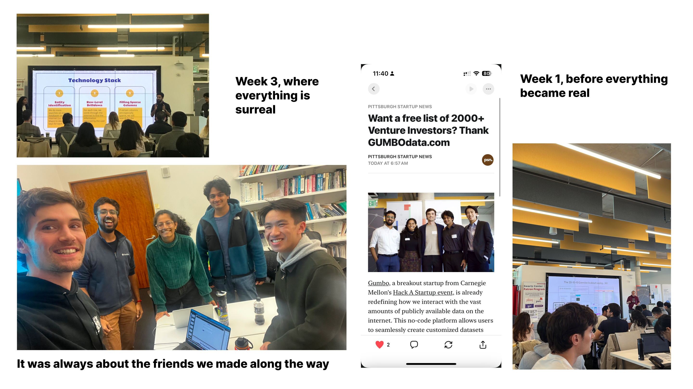

- [Pitch Deck](https://docs.google.com/presentation/d/1TSwtRvmYBkPvi18YF8laUhy1U2AIfiQqPN5sfx4EmY8/edit) / [Live website](https://gumbodata.com/)

- Decided to compete in Hack a startup, by CMU's Swartz Center for Entrepreneurship.
- We formed a team of 5, from MSAII, CMU - Jack, Prachi, Tyler, Akshay and myself.
  
- Had a bunch of discussions to decide what to pick as our problem statement
- Loved the idea for something which could create datasets for machine learning
- Jack had this conviction that we could create an anything API, which could create structure from the internet
- Bunch of days passed (discussions were fun)
- D Day hits on Sat (Nov 2nd). We pitch a couple options. Adam's session on 20-10-10 stood out.
- We got to TCS. I had to take a detour. Got back after a while. We brainstormed till 2 AM, and then 2 AM hit again cause daylight savings.

- Morning, had feedback from Alex. Changed out pitch. We were ready to go.
- Couple of hours in, we were good.
- By evening, we got to know we were a finalist, which meant - we had 2 weeks to build, do market research and anything we could to show the solution was viable. VC judges were coming in.
- Days of work. (Lots of stories here)
- [Feedback from Adam - also psn feature](https://pittsburghstartupnews.substack.com/p/want-a-free-list-of-2000-venture).
- Arthur was a beacon of light, throughout the process. Indebted to him.
- Pat was also right there with us, helping us figure out everything from viability to a good business model.
- Final day arrives. We pitch, but get hit by the "scraping is bad" idea.
- We were disheartened but not defeated. We knew we had something good.
- Signed up for AI Venture Studio. We'll see where this goes.
- Got a call from InnovatePGH. We talk on Dec 5th.
