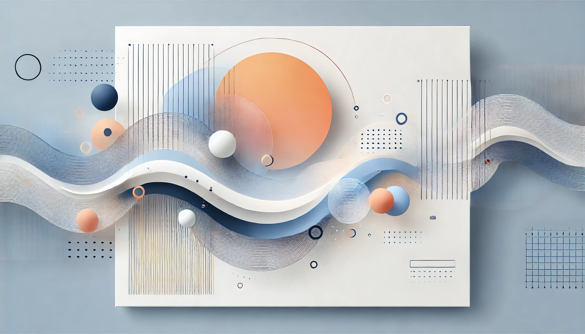

> Understanding Diffusion Models: A Hands-on Implementation Guide



As someone diving into the world of generative AI, I've been fascinated by the magic behind diffusion models. In this post, I'll share my journey of implementing a diffusion model from scratch, breaking down the key concepts and code structure. We'll focus on understanding U-Nets and the diffusion process, which are fundamental to models like Stable Diffusion.

Colab link: [Diffusion Model Implementation](https://colab.research.google.com/drive/1rdh73yBYtgBkLOdcumkAwwN516FJytpF?usp=sharing)

## The Big Picture

Before we dive into the code, let's understand what we're building. Diffusion models work by:

1. Gradually adding noise to images (forward diffusion)
2. Learning to remove that noise (reverse diffusion)
3. Using this denoising process to generate new images from pure noise

Think of it like slowly dissolving an image in acid (adding noise) and then learning the exact chemical process needed to reconstruct it (removing noise). Once we know how to "un-dissolve" images, we can start with random noise and create entirely new images!

## Key Components

### 1. The Noise Schedule

The heart of any diffusion model is its noise schedule. This determines how much noise we add at each step:

```python
def __init__(self, num_timesteps=1000, beta_start=1e-4, beta_end=0.02):
    self.betas = torch.linspace(beta_start, beta_end, num_timesteps)
    self.alphas = 1 - self.betas
    self.alphas_cumprod = torch.cumprod(self.alphas, dim=0)
```

Think of `beta_start` and `beta_end` as controlling how aggressive our "image dissolution" process is. We start gentle (`1e-4`) and gradually get more aggressive (`0.02`). The `alphas` help us keep track of how much of the original image remains at each step.

### 2. The U-Net Architecture

The U-Net is our denoising powerhouse. Its structure is particularly clever:

```python
class UNet(nn.Module):
    def __init__(self, input_channels=3, hidden_dims=64, time_emb_dim=256):
        # Encoder path
        self.conv1 = self.make_conv_block(input_channels, hidden_dims)
        self.conv2 = self.make_conv_block(hidden_dims, hidden_dims * 2)
        self.conv3 = self.make_conv_block(hidden_dims * 2, hidden_dims * 4)

        # Decoder path with skip connections
        self.upconv3 = self.make_upconv_block(hidden_dims * 8, hidden_dims * 2)
        self.upconv2 = self.make_upconv_block(hidden_dims * 4, hidden_dims)
        self.upconv1 = self.make_upconv_block(hidden_dims * 2, hidden_dims)
```

The U-Net gets its name from its shape:

- It first goes down (encoder), compressing the image
- Then back up (decoder), reconstructing the image
- Skip connections (those torch.cat operations) help preserve fine details

What surprised me most was the time embedding. Each denoising step needs to know "how noisy" the input is:

```python
class SinusoidalPositionEmbeddings(nn.Module):
    def forward(self, time):
        embeddings = math.log(10000) / (half_dim - 1)
        embeddings = torch.exp(torch.arange(half_dim, device=device) * -embeddings)
        embeddings = time[:, None] * embeddings[None, :]
```

This clever encoding lets our model understand the noise level it's working with at each step.

## The Training Process

Training a diffusion model is like teaching someone to solve a puzzle by first showing them how to unmix paint colors:

```python
def train_diffusion_model(diffusion, model, dataloader, num_epochs, device, learning_rate):
    for epoch in range(num_epochs):
        for batch in dataloader:
            # Pick random timesteps
            t = torch.randint(0, diffusion.num_timesteps, (images.shape[0],))

            # Add noise and try to predict it
            loss = diffusion.p_losses(model, images, t)
```

The fascinating part is that we're not directly teaching the model to generate images. Instead, we:

1. Take a real image
2. Add a known amount of noise
3. Ask our model to predict what noise we added
4. Use the difference to improve our model

## Generating Images

The magic happens during generation:

```python
def sample(model, diffusion, shape, device, num_steps=1000):
    # Start from pure noise
    x = torch.randn(shape, device=device)

    for t in reversed(range(0, num_steps)):
        # Gradually denoise
        predicted_noise = model(x, timesteps)
        x = update_x_with_predicted_noise(x, predicted_noise, t)
```

We start with random noise and repeatedly:

1. Ask our model "what noise do you see here?"
2. Remove that predicted noise
3. Repeat until we have a clean image

## Lessons Learned

Building this from scratch taught me several key insights:

1. The U-Net architecture is surprisingly robust. Those skip connections really make a difference in preserving image details.
2. The noise schedule is crucial. Too aggressive, and your model never learns. Too gentle, and training takes forever.
3. Time embeddings are essential. Without them, the model has no way to know how much denoising is needed.

<!-- ## Common Pitfalls

Some challenges I encountered:

- **Memory Usage**: The U-Net can be memory-hungry. Start with small images and batch sizes.
- **Training Stability**: Using a learning rate schedule and gradient clipping helps prevent training collapse.
- **Sampling Speed**: The reverse process takes many steps. Techniques like DDIM can help speed this up. -->

<!-- ## Next Steps

If you're implementing this yourself, consider:

1. Experimenting with different noise schedules (linear, cosine, etc.)
2. Adding conditioning to generate specific types of images
3. Implementing classifier-free guidance for better quality
4. Trying advanced sampling methods like DDPM or DDIM -->

## Conclusion

Building a diffusion model from scratch has been an incredible learning experience. While modern architectures like Stable Diffusion are much more complex, the core principles remain the same. Understanding these fundamentals has given me a much deeper appreciation for how these models work.

Remember, the key to learning this stuff is experimentation. Try changing parameters, visualizing intermediate steps, and most importantly, don't be afraid to break things. That's often where the best learning happens!

---

_Note: The complete code for this implementation is available in the accompanying repository. Feel free to experiment and extend it further!_
