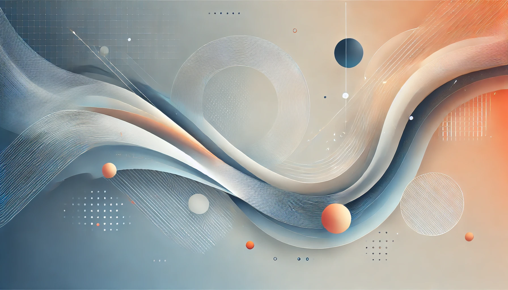
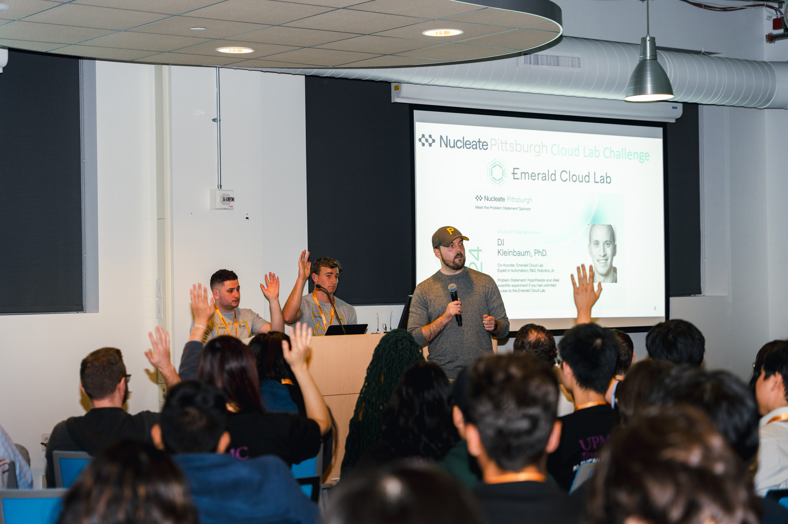
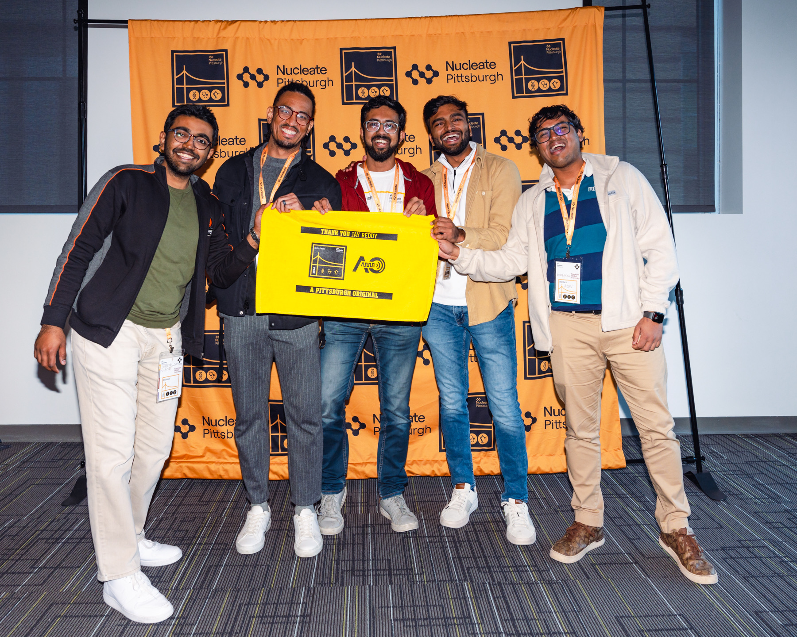

Hackathons have always been my thing, but when Pittsburgh Biohack rolled around, I wasn’t sure I’d make it. Tight deadlines, a packed schedule, and the sheer energy it takes to dive into a 36-hour coding marathon had me hesitating. But something about the idea of teaming up with brilliant minds from different universities and tackling cutting-edge challenges pulled me in. Fast forward to the end of the weekend—we walked away as winners of the Biohealth track, and I can confidently say it was one of the most exciting experiences I’ve ever had.

---

## The Problem: Making Cochlear Surgeries Safer

Cochlear implant surgeries are hard. Surgeons have to thread electrodes through a passageway that’s sometimes less than a millimeter wide. The stakes are high, and the current mechanisms don't provide realtime feedback during the process. We chose this problem statement, seeing an innovative product that Advanced Optronics was working on. A force sensor that could transmit the total stress on the electrode. We wanted to experiment how this could best relay information to practitioners. Most systems provide visual feedback—numbers, graphs, or warnings on a screen—but imagine trying to look away from your work when every move matters. It’s not ideal.

%20(1).png)
###### [ Caption: Scenes from the hackathon, talks, brainstorming and moments before the pitch. ]

That’s where we saw an opportunity. What if, instead of pulling their attention away, we gave surgeons feedback they could feel, in real-time, without ever breaking focus?

---

## The start

Right off the bat, the vibes were amazing. Bakery Junction at Pittsburgh is called AI square for a reason. The amount of big tech buzzing around us was insane. That also meant getting to talk to the engineers and designers who work on real world products, impacting people at scale. I could barely conceal my excitement. 

## The Idea: Turning Phones Into Surgical Tools

Our solution was simple but powerful: haptic feedback. You know that little buzz you get when your phone vibrates? We wanted to bring that same intuitive, physical sensation into the operating room. Using actuators, we created a system where vibrations would give surgeons real-time guidance—on their thigh, back, or another non-sterile part of their body. For the hackathon, we used a mobile phone as it serves as an easy way to get a feel for the product (keeping costs down during the development phase), and once ready, move to an actuator.

This way, they could stay laser-focused on the patient while receiving instant feedback. The breakthrough moment came when we tested the idea on ourselves, realizing how natural it felt to interpret vibrations as cues. It was like bringing the tactile simplicity of a gaming controller to one of the most delicate procedures in medicine.

---

## The Madness of Prototyping in 36 Hours

Hackathons are all about moving fast and thinking faster. This was also my first hackathon after LLMs became crazy good and my god, the speed at which we could prototype was phenomenal. Our team clicked right away, bouncing ideas off each other and leaning into each person’s strengths. 

###### [ Caption: A tech talk on wetlabs, during the hackathon ]

One game-changing moment came during a chat with the founder and CEO of Advanced Bionics. We pitched our idea, and he immediately got it. He pointed out how visual feedback systems often fall short and encouraged us to explore how tactile solutions could change the game. That validation gave us the push we needed to double down on our concept.

---

###### [ Caption: Moment of truth, we won the health tech track! ]

## After the Hackathon: Where Do We Go From Here?

Winning felt incredible, but the real excitement came after, when we realized this idea might have legs beyond the hackathon. We got to sit down with the co-founder of a startup in the field, and his feedback was eye-opening. He loved the potential of haptic feedback and suggested we dig deeper into UX research—testing different types of vibrations to figure out what surgeons actually prefer. He also raised an interesting challenge: could we use machine learning to predict surgical errors in real-time? The idea was thrilling, but medical laws and the lack of accessible data pose a steep challenge.

---

## The Best Part? The Hackathon Experience

Let me take a moment to rave about how well-organized Pittsburgh Biohack was. From the unlimited snacks (thank you, Target!) to the late-night brainstorming sessions fueled by endless coffee, the whole event was a blast. It was the kind of environment where creativity thrived—supportive, fun, and filled with brilliant people.

Hackathons like this remind me why I love them so much. They’re chaotic, exhausting, and intense, but they also give you the space to think big, experiment, and push yourself in ways you didn’t think possible. Whether or not you win, you walk away with new skills, new friends, and new ideas.

---

## Looking Ahead

Our haptic feedback solution has a long way to go, but we’re already dreaming of the possibilities. With the right research, refinement, and maybe a little luck, I believe it could change the way surgeons work—making procedures safer, more intuitive, and less prone to error.

For now, I’m just grateful for the experience, the people I met, and the thrill of building something truly innovative. If you’re on the fence about going to a hackathon, let this be your sign: go for it. You never know what you might create—or how it might shape the future.
