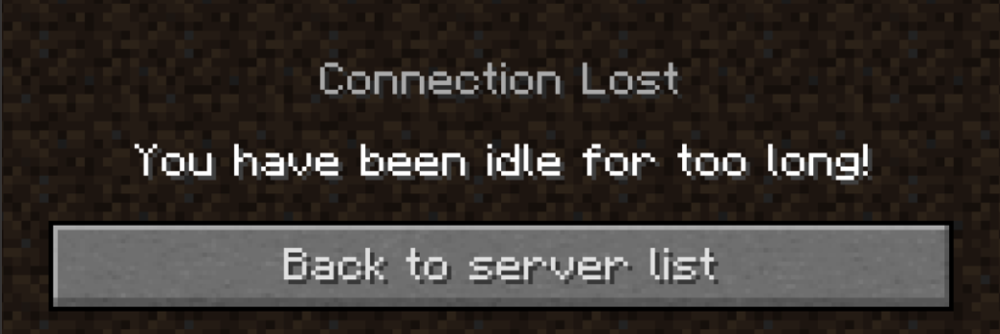
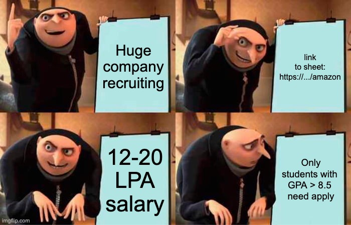
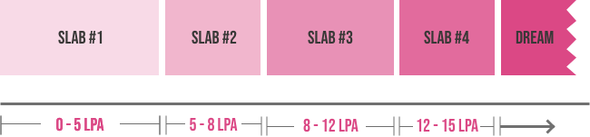
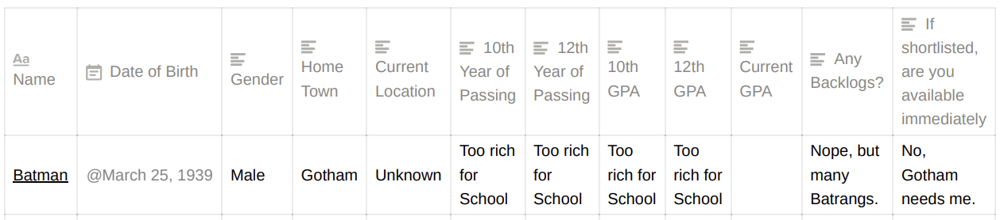
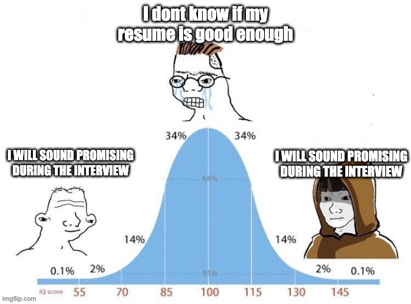
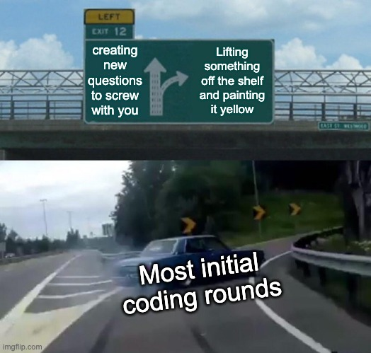
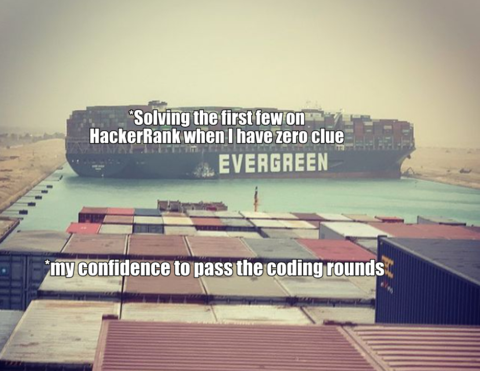
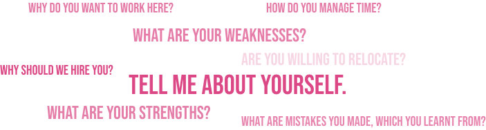

There are not too many points in a person's college time where one gets the heebie-jeebies so bad that they feel - what is the right word here? It's a mix of fear? Pressure? Panic? I could go on, but you see my point. In a nutshell, it's cluelessness and a huge question mark hanging in front of them, asking, "Are you even remotely prepared for this crap?". This feeling hit me on July 8th 2020, when our class placement coordinator sent a text to our group that said, "Placements will start soon. Prepare your resumes."

Now I'll admit, I was definitely not unprepared to hear those words but I don't think I was too eager to hear them either. Flashback to Abhishek from June 2020. COVID had come along and turned him into a relaxed little couch potato, who didn't look at the mirror often. Clearly, the objects he feared were closer than they appeared and also he'd put on a few extra pounds.

##### Accurate representation of the situation if this were Minecraft

This is a weird spot to be in. Well, I skimmed through, with what I think was a halfass map and here I am, putting together a few pieces of the same which I really hope are right (and more importantly, right for you).

Alright. I'm guessing you came to read this for actual advice, and you see me blabbering like one of those recipe blogs that go over their entire life stories, so I'm taking the more responsible route of cutting to the chase _cue road runner music_.

How are placements gonna be? Short answer - messy, and honestly a bit tough on you. Long answer - Well, it depends, and that's why it's the long answer. In fact, I encourage you to read this, especially if the short answer didn't appeal to you.

## The Process

---

So there's on campus and off campus calls. I'd be focusing on the on campus ones in this essay. It starts with a spreadsheet shared by the CGPU. You might've heard that they look like this.

##### You're lying if you say you haven't heard this

More often than not, that number is like 6 or 7, so don't be too harsh on yourself if you didn't maintain a great GPA. You should be fine for the most part. There is something you MUST be careful about though. It can deny you better placements even though you were eligible for it. Slabs. They're used to put you into brackets of salaries.

##### Note: This was the split for my batch. Yours might be different. Confirm with your placement coordinator

Anything above 15 was classified as dream/super dream and they didn't provide a distinction since only few recruiters came with higher packages that year. Point is, if you get placed at a 6 LPA company, then you lose any chance of interviewing for an 8 LPA company because of the slab (Exactly which slab the packages of 5, 8 and 12 LPA fall in were not mentioned. Confirming with your CGPU coordinator would be a good idea).

There is one more type of company. It's called a core company. The speciality is, if you get picked by a core company, your only next option is a dream company. Everything else is blocked out.

Be extremely careful when applying for these kind of companies. Be sure you want to be there, if you're applying. There's also a concept of Day 1 companies, where you can appear for all interviews and choose in the end. They all offer similar packages (and are supposed to recruit on the first day the college starts recruiting, hence the name) but generally actually recruit across a few months, but getting placed in one of these didn't bar us from sitting for the other Day 1 companies. Eg: Capgemeni, L&T etc.

How do you plan better? Well, having an idea of which companies to target could be a first. Now I don't have access to CGPU data but I do certainly have the emails they sent me. **I've aggregated them into a [timeline](https://www.notion.so/CET-Recruitment-2020-2b9dda814a744f4fa93180f61d3d2627)** **of when which company came**. You can take a look there and have at least a start for planning it out. (Go click that link. I put a lot of effort into making it)

Right. Now you have an overview of the process. Now let's check on the prerequisites. For pretty much every recruitment call you're applying, you'd fill out a sheet like this, and soon after you'd be asked to send in your resumes. This again is something a lot of you are likely to be worried about.

##### Yeah this is kind of what it is for campus placements

## The Resume

---

I want to keep this brief so I'll throw in a few ideas for your resume.

For the most part, the resume is the document that helps get you an interview and it isn't entirely what you are selected based on. As long as it looks professional, you're gonna be fine here. (For off-campus placements, this is the exact reason why a super-strong resume is mandatory since yours has to stand apart from the 100k others).

I like to follow this format called the careercup resume, which neatly puts out everything a recruiter may wanna see in the most elegant yet compact way possible. (Feel free to experiment as well. I did add a few of my own touches to mine). This template was made by [recruiters](https://www.gayle.com/) who hire for Google, Amazon and the like.

In a nutshell, make sure you list out the following (In my opinion, in this same order)

- Education (Since we're freshers)
- Work experience / Internships - especially if its at nice places
- Tools / Technologies - I'd suggest sticking to what you're good at, and what you have used
- Projects - Especially hosted ones. Clicking a link and seeing something real is a huge plus.
  - [Here's](https://towardsdatascience.com/simple-guide-to-hosting-project-on-github-aebf6f3c6f97) how you can host simple ones.
- Leadership / Volunteering / Achievements
- Certifications (Relevant ones ONLY)

There's like a more generic but detailed guide available for the same. Feel free to check it out [here](https://www.careercup.com/resume).

## The Aptitude Round

---

Remember your JEE days? Yeah this is that but easier. Generally aptitude tests have all your mental ability questions, and a few reading comprehensions (Pro tip: keep these for last. This basically saps away too much of your time) coupled with sections on your core field of engineering or maybe a few code snippets and questions based on them. Think of these as a strainer. The whole point is to make a first level assessment of who are potentially good. Scoring decently will generally carry you across. No need to be a 10 pointer here.

To the best of my knowledge, as long as you can do "quick maffs", and match patterns and know basic stuff related to your branch, you should be fine here.

##### Yeah, this happens mostly in your imagination

I'd be lying if I said I complete most of my aptitude tests in time. That's intended. It's a feature, not a bug. Think of how you'd construct a test to rank people. The more the scope for everyone getting different scores, the easier for you.

## The Coding Round

---

Things get interesting here. There's a lot of variety in the concepts and level of difficulty of questions that are thrown at you. The one common thing about all of them is, coding is ... well coding. They can't ask you stuff outside of CS, and having a strong foundation in your data structures and algorithms is the way to kick ass here. Let me simplify that down a bit more.

Think from the recruiter's perspective. Making new questions is actually a fairly cumbersome process. Generally, they pick some form of a question that already exists and make a small iteration or add an extra condition or something. If you've had experience with coding, think of it as - You see programs for printing all odd numbers everywhere, and the recruiter now says - Print all odd numbers that are also divisible by 5. This is the general idea.

##### It's the same stuff you do with your answers to evade plagiarism detectors

Okay so now that we know what the general idea is, the obvious next step is to know what these "off the shelf" questions are. You're in luck. It mainly involves the following concepts.

- Arrays
- Linked Lists
- Stacks and Queues
- Trees
- Graphs

Hold your horses. I have a feeling a lot of you did the 👀 on me. That's fine. I get that some of you may have heard about this, and some of you may have practice with a bit of this and some of you are about to switch back to Instagram because you hate me now. Chill. I'm here to help you through this.

##### Okay I'm sorry. But am I really?

Everyone says that you can just jump onto someplace like HackerRank or CodeChef and practice and come out feeling all Chad. I'm sure a lot of you at some point have in fact tried that. Guess what? It's not exactly a piece of cake. I'm gonna walk you through how I actually ended up getting through these. (Yes. I know. I'll keep it super short).

**Step 1**: Type hackerrank.com into the browser. Trust me, this was the hard thing for me. Once Im done with the frustration that I have to solve problems, it gets easier. (Its H for HackerRank and not Y for YouTube, for that sly section of you guys who get confused once you start typing).

**Step 2**: Pick up a language that you're comfortable with and pace into a question. Click one of the easier ones to feel good about yourself at least in the beginning.

IF you have absolutely no clue, check out a few of the hints/suggestions. It's generally there in the comments or editorial.

If you still have zero clue, take a look at the answer. No, not copy-paste it into the editor, rather a look at what they did, and try to recreate the same, by yourself [ Trust me, most of the code people do in the real world is taken off of StackOverflow. As long as you know what is happening, this is totally fine. In fact, this was how I began getting good quickly at competitive coding ]. Quick and dirty at first, but with a bit of practice, you'll be thinking along the right ways more often than not.

And here's the list everyone puts at you - [exercism.io](http://exercism.io), [hackerrank.com](http://hackerrank.com), [interviewbit.com](http://interviewbit.com) (slightly more advanced), [codechef.com](http://codechef.com), [hackerearth.com](http://hackerearth.com) and [geeksforgeeks.com](http://geeksforgeeks.com) if you wanna practice at your own pace.

This is not the easiest thing to do and keep up with, motivation is hard so I would suggest you do this with someone who could tag along. Kind of a peer system. I must admit again, I don't know what the right answer here is for everyone. It depends. I can assure you that if you stick to practicing, you'll be reaping the benefits pretty soon.

Aight, that was longer than I intended, but I wanted to be clear on the method.

## Interviews

---

This is probably what gives everyone heavy duty anxiety. A lot of you may be having the job interview as the first ever actual interview in your life. I'm gonna try to explain the process and give you a few tidbits on what I did to help myself through it.

First of all, most interviews are gonna be a conversation. A majority of the folks interviewing you are good people too, even if they might not be great interviewers. They don't want to pin you down, contrary to what many may have heard. It's slight pushes and jerks they give to get a feel for how you respond to different kinds of questions. It's not just your technical ability that is being tested. How comfortable you are with saying "I don't know, but this is what I understand about the matter. I shall check it up if it's needed on the job" or how confident you manage to carry yourself through times of pressure.

When in doubt, invert. This is something I always tell myself. I'll explain. Rather than think hard about what answer to give to sound smart, you could simply put yourself in their shoes and understand what they'd expect. Trust me, while the right answer is a great thing to know, having a great attitude helps a lot too. Think of what you'd be fine hearing as an answer for whatever was asked. Chances are, you'd be able to get away with it. Also, think of where you don't wanna end up. Eg: you don't wanna end up in a spot where you say you know Java and they ask you how to initialize an ArrayList and you look back and curse yourself for saying that you knew it. Be smart about your bluffs.

##### Fastest "I know Java" to "I don't know Java" in existence.

Generally here are the things you should be prepared for.

1. Tell me about yourself.
2. Why you?
3. Why us?

A bit of googling about the company and connecting your story with their mission is a neat way to answer #2 and #3.

Getting to the tell me about yourself, its a place to get creative as there is no definite right answer. I have a framework for my interviews and it has worked pretty well for me and you're free to try it out. It goes a little something like this.

The interview is a conversation. When you talk about uninteresting stuff, the conversation becomes boring. (Yeah, I know, they're paid to listen to you anyways, but you want to improve your chances right? right?)

How I go about it is, I sat down and listed out a lot of things that happened in college. Put them together to form a story of sorts. Everyone likes stories. If you're not the most imaginative person, ask for help from someone who is, or at least link these events together to make it look like a sequence of events that is leading to your development, in a very positive way.

##### Please don't make it end this way. Anything but this.

The beginning of your answer to #1 is what I like to call "the hook". It gets the interviewer hooked onto the conversation. These can be things like a cool incident that happened to you, or maybe this thing you're running or a story about how you started liking a hobby and flow your way a series of events that ended up leading to you being where you are right now. Additional points if it's connected to the vision of the place. For me, Providence was in the healthcare sector and I talked about building something to assist those with ALS in a hackathon, so they were instantly interested. The actual product was not too great but the way I described the experience and how we tackled issues that came up, and our drive to win was what I think caught their eye.

Go slow, it's a conversation, you don't want to make it a speech. When you go slow, they'll develop an interest in your story and will ask questions. Give good responses to these questions to keep them hooked. (Pro tip - Think of what places they're likely to ask questions earlier and have answers ready beforehand. Planning is your ultimate friend here).

From there, once you've got them hooked to your story, keep the conversation alive and keep the interviewer interested. It works wonders. It need not be you building the next Google clone. It could just be about your persistence in fixing a bug or getting a few friends together to go for / host that event. Show signs that you'd be valuable to any team you're a part of. Someone who takes ownership, someone who is compassionate, responsible and knows to push hard even when things didn't seem great.

I remember talking about changing variables in CSGO to set my accuracy to 100% (My friends would probably tell you a long story about my addiction to CSGO but that's for a different day). Show that you're capable of solving problems (not necessarily with code). They'll pop in with questions here and there and you can give them a good vibe with the way you have it all structured.

I have a feeling you understand what I'm hinting at with this idea so let's move on to the next one.

## The HR Round

---

This is by far the most predictable round of all. The questions are standard.

The ones in the graphic are very generic questions but with very specific answers depending on who you are, making them really good questions to rank all potential hires. Like in the interview, there are no default right answers but what I've seen and heard is **honesty + 10% thallu** (h/t [@bumblebitchblues](http://instagram.com/bumblebitchblues)) generally works out.

My thumb rule was to prepare in advance for the default questions and linking those around to the new questions that come up, while still being myself ie not pretending to be the perfect person. The key here again is to keep talking but this time, not about the technical aspects rather about the team aspect, where maybe you took initiative to do something under a tight deadline, or maybe you led a team through a tough task. Basically, the idea is to give the interviewer confidence in you as a person, to show that you have values that they'd want to have at their organisation.

Take a look at [this](https://www.upgrad.com/blog/hr-interview-questions-answers/) blog. They give a neat framework for how to think when crafting your HR answers.

Among the important things they look for here are if you'll pair along well with the existing teams. If you can figure out how to convey "**Yes I will!**" to the interviewer, then you're mostly good here too.

## In summation

---

It all comes down to the actual day and your mindset but with a decent amount of preparation, you can reduce the number of things out of your control. Don't worry too much. As I said at the start, the folks who come to interview you are human too. They want you to succeed as much as you do since that's why they're hiring in the first place. Help them understand why you'd be a good person to have in their workplace, their circle or even their team.

Give strong arguments about your qualities, and give examples of how you applied these in real life. You don't need to be the best coder or the one with the highest GPA, show them that you're an understanding person, someone who will have their back, who is willing to put in the work, and take responsibility irrespective of the result. I mean, isn't that the kind of person you'd want on your team?

##### Of course I had to do the cliche ending. I mean, have you met me?

Thanks to Megha Nanda, Jacob Abraham, Krishna Prasad Shyam Nambiar, Athena Renjit and Mohammed Rabeeh for their feedback on early drafts of this.
