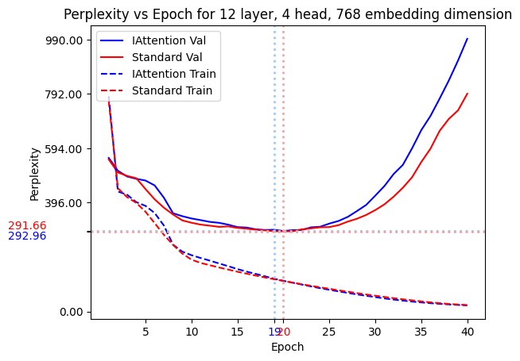
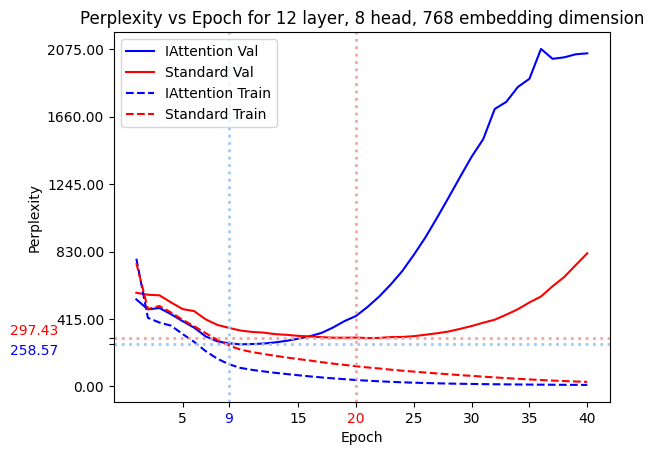
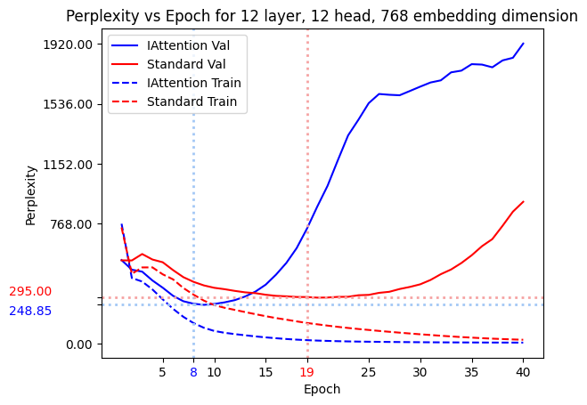
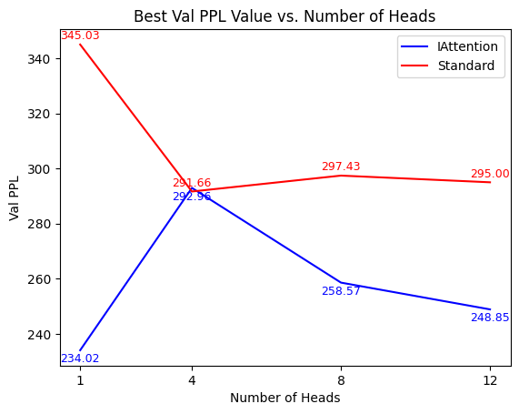
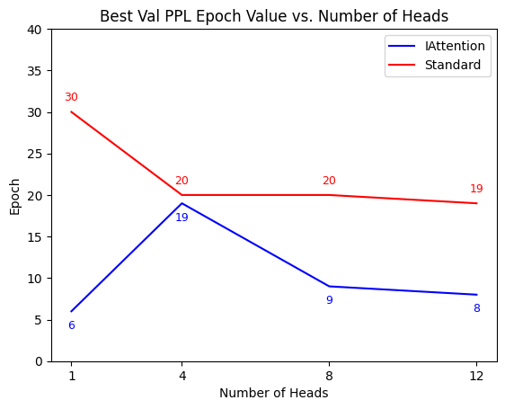

**Authors:** Akshay Sivaraman, Natjanan Mongkolsupawan, Abhishek Sankar  
**Course:** 10-623 Generative AI (CMU)

## Introduction

Standard self-attention has a built-in parameter symmetry: multiple parameter settings produce the same score matrix. This creates redundant degrees of freedom that can slow optimization.

For each head, attention scores depend on:

$$
S = W_Q W_K^\top
$$

and remain unchanged under:

$$
W_Q \leftarrow W_Q R,\quad W_K \leftarrow W_K R^{-\top}
$$

for invertible $R \in \mathbb{R}^{r \times r}$.

## Key Hypothesis

Because of this invariance, each head contains approximately $r^2$ redundant degrees of freedom in $(W_Q, W_K)$. A similar redundancy appears in $(W_V, W_O)$.

The paper proposes a canonical parameterization ("I-Attention") that removes this redundancy while preserving expressivity.

## Proposed Formulation

- Fix part of key/output structure to a canonical orthonormal basis (identity-aligned form)
- Learn the remaining components
- Preserve representational power of standard attention
- Reduce parameters by roughly $2r^2$ per head

---

## Experiments Performed

- **Model family:** GPT-2 Small style decoder-only transformer
- **Dataset:** WikiText-2
- **Training setup:** 40 epochs, batch size 32, AdamW, GPT-style LR schedule
- **Configs compared:** standard attention vs I-Attention at 1, 4, 8, and 12 heads
- **Primary metrics:** train/validation perplexity and epoch-to-best-validation perplexity

## Final Results

### Perplexity Curves Across Head Configurations

*Single-head attention (standard vs I-Attention).*

*4-head configuration (standard vs I-Attention).*

*8-head configuration (standard vs I-Attention).*

*12-head configuration (standard vs I-Attention).*

### Best-Validation Scaling Results

*Best validation perplexity as head count scales.*

*Epoch at which the best validation perplexity is reached.*

### Summary Table

| Model | Params | PPL (for 1, 4, 8, 12 heads) | Epoch/Step to Best Val |
| --- | ---: | ---: | ---: |
| Baseline Attention | 124M | [345, 291, 297, 295] |[30, 20, 20, 19] |
| I-Attention | 110M | [234, 292, 258, 248] | [6, 19, 9, 8] |

## Main Takeaways

- I-Attention preserves practical performance while removing symmetry-related redundancy.
- Convergence tends to improve because optimization spends less effort in redundant directions.
- Gains are consistent enough across tested head configurations to justify the canonical parameterization.
- This is not a low-rank approximation; it keeps expressive capacity while improving parameter efficiency.

## Notes
- This page is a curated single-column web reading version; use source `.tex` and PDF for full detail.
