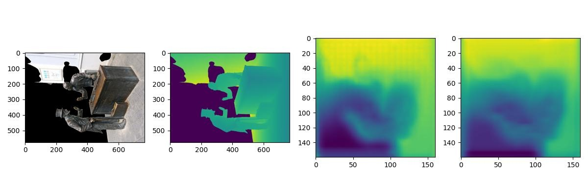
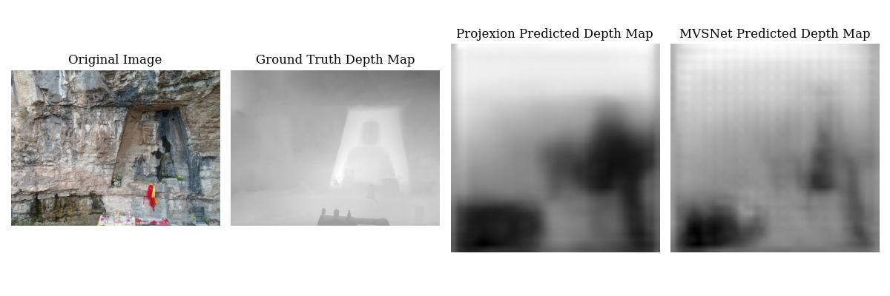
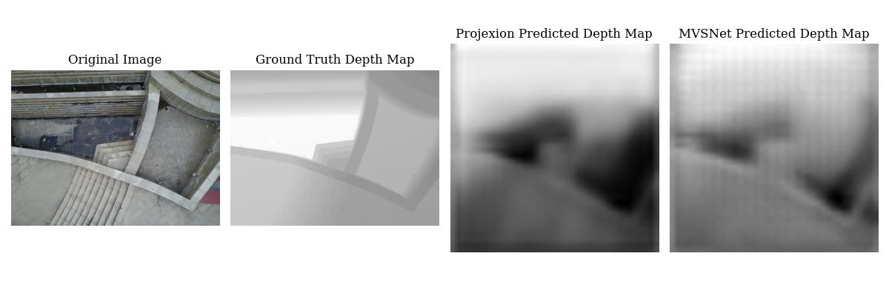
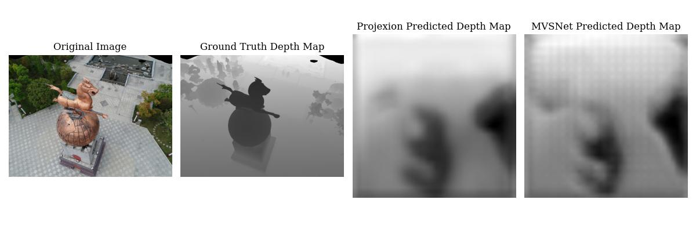
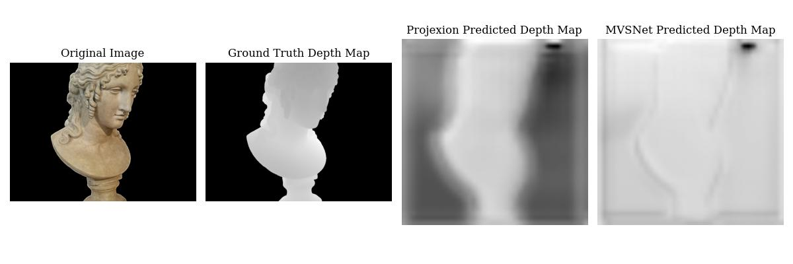

**Team 18:** Santiago Arambulo, Abhishek Sankar, Nikita Chaudhari, Maitri Gada
**Date:** April 2025

## Abstract

This project reproduces and extends MVSNet for multi-view 3D reconstruction. It combines:

- CNN feature extraction
- differentiable homography warping
- 3D cost-volume regularization
- depth regression and fusion

The project also introduces a self-attention-based fusion variant ("ProjeXion") and evaluates robust loss behavior on challenging depth distributions.

## Problem Setup

Given calibrated multi-view images, estimate depth maps and reconstruct scene geometry with high fidelity under occlusion, scale changes, and lighting variation.

## Project Diagram

*High-level pipeline used for feature extraction, homography warping, attention-based fusion, depth prediction, and refinement.*

## Baseline: MVSNet

The baseline follows a cost-volume pipeline:

1. extract per-view features
2. warp features across depth hypotheses
3. aggregate to a volume
4. regularize with a 3D CNN
5. regress depth

## ProjeXion Extension

The extension focuses on view fusion quality:

- introduces self-attention-based recurrent fusion
- tests robustness under difficult outlier-heavy depth regimes
- swaps standard regression loss with Cauchy-style robustness where helpful

One robust objective form used in practice:

$$
\mathcal{L}_{cauchy}(e) = \log\left(1 + \frac{e^2}{c^2}\right)
$$

where $e$ is depth error and $c$ controls outlier sensitivity.

## Findings

- Reproduced MVSNet remains a strong baseline with good qualitative detail.
- Naive architectural extensions can underperform if fusion and optimization are not tightly coupled.
- Loss design and data distribution awareness substantially affect training behavior.

## Practical Takeaway

Improving reconstruction requires both architectural innovation and careful optimization design. Better multi-view fusion strategies likely need stronger geometric priors and stability-focused training objectives.

## Final Results

### Summary Result Panel

*Overall qualitative comparison panel from the report.*

### Result Samples

*Sample qualitative output: input, ground truth, ProjeXion prediction, and MVSNet prediction.*

*Sample qualitative output: input, ground truth, ProjeXion prediction, and MVSNet prediction.*

*Sample qualitative output: input, ground truth, ProjeXion prediction, and MVSNet prediction.*

*Sample qualitative output: input, ground truth, ProjeXion prediction, and MVSNet prediction.*

## Notes

This is a curated web reading version for single-column browsing. For full experiments, tables, and visuals, see the original PDF link above.
